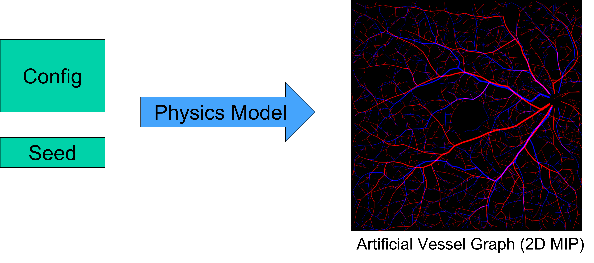
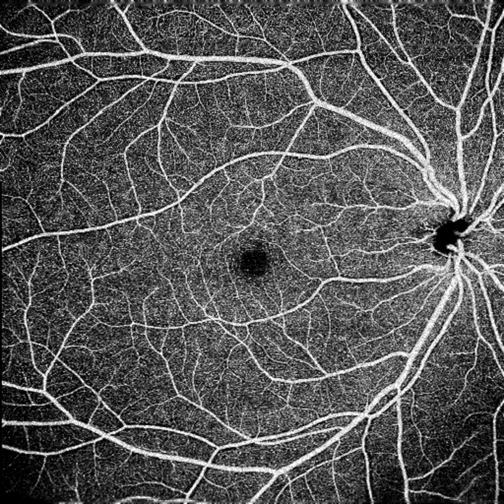
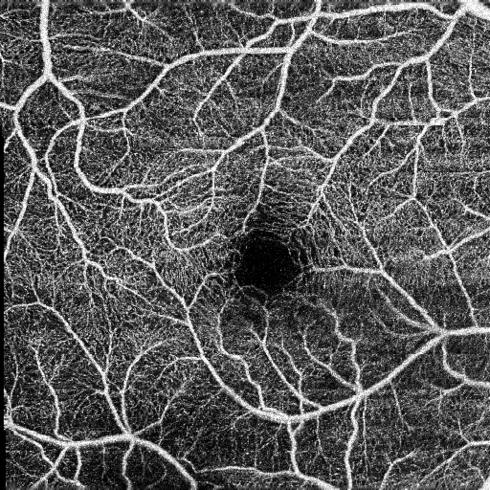
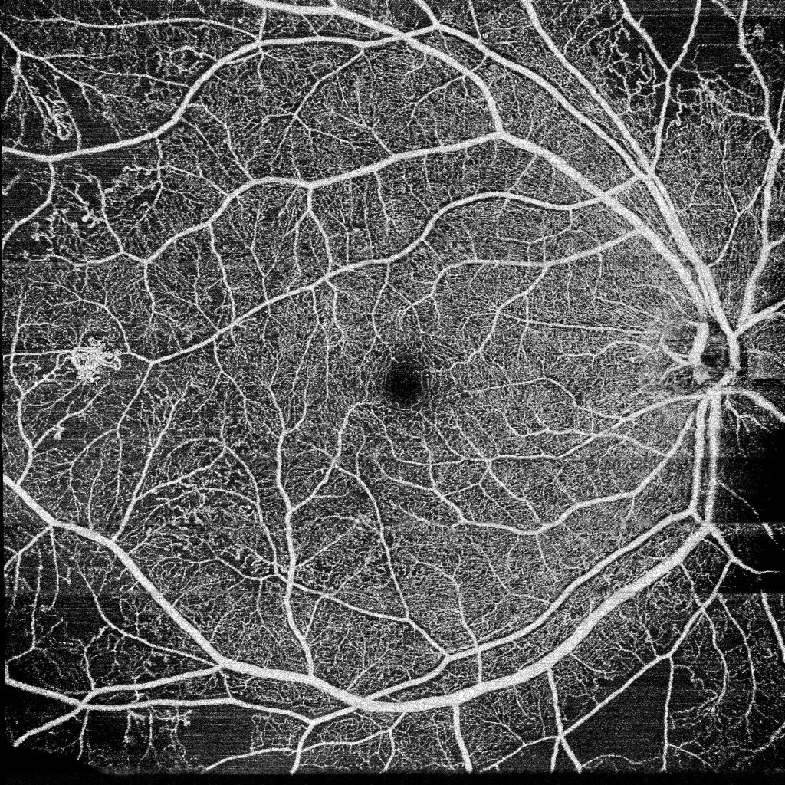
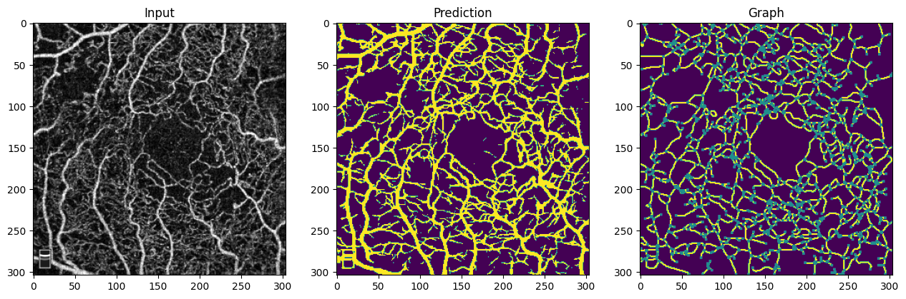

# OCTA-seg
This project is part of a Master's Thesis <b>"Machine Learning for Vascular Analysis in Optical coherence Tomography Angiography Images"</b>.

## Overview
The project investigates the effectiveness of machine learning tools to automatically analyze Optical coherence Tomography Angiography (OCTA) images based on the visible vessel topology. Applications include segmentation of vessel graph and classification of deseases. Since there are only very few labeled OCTA image datasets, we make use of artificial data. We use a sophisticated physics model to simulate realistic vessel growth.

We simulate both the Deep Vascular Complex (DVC), as well as the Superficial Vascular Complex (SVC), merge them together and apply a variety of data transformation to make to make them more realistic. While it is desirable to make the images a realistic as possible as a whole, it suffices for our application to replicate structure and contrast at certain places as we would see it in real data. A segmentation network can then be trained in a supervised fashion to predict vessel maps.

These vessel segmentation maps can then be used to extract a vessel graph and its features. For this we use the free available software [Voreen](https://www.uni-muenster.de/Voreen/) by the University of Münster. The extracted graph features provide quantitative features for further analysis.

We can also use the extracted segmentation map as additional input to another network and aid further classification tasks.

## Example Applications
### 1. Diabetic Retinopathy Analysis on ultra-wide OCTA
The following abstract is taken from the [MICCAI 2022 Diabetic Retinopathy Analysis Challenge (DRAC)](https://drac22.grand-challenge.org/).
> Diabetic retinopathy is one of the leading causes of blindness and affects approximately 78% people, with a history of diabetes of 15 years or longer. DR often causes gradual changes in vasculature structure and resulting abnormalities. OCT angiography (OCTA) has the capability of visualizing the retinal and choroidal vasculature at a microvascular level in great detail.

> The traditional diagnosis of DR grading mainly relies on fundus photography and FFA, especially for PDR, which seriously endangers vision health. FA is mainly used to detect the presence or absence of new blood vessels. Fundus photography is difficult to detect early or small neovascular lesions. FA is an invasive fundus imaging that cannot be used in patients with allergies, pregnancy, or poor liver and kidney function. The ultra-wide OCTA can non-invasively detect the changes of DR neovascularization, thus it is an important imaging modality to help ophthalmologist diagnose PDR. However, there are currently no works capable of automatic DR analysis using UW-OCTA. In the process of DR analysis, the image quality of UW-OCTA needs to be assessed first, and the images with better imaging quality are selected. Then DR analysis is performed, such as lesion segmentation and PDR detection. Thus, it is crucial to build a flexible and robust model to realize automatic image quality assessment, lesion segmentation and PDR detection.

| \ | Normal | Pre-proliferative retinopathy | Proliferative retinopathy |
| :--: | :--: | :--: | :--: |
| **Sample Image:** |  |  |  |

### 2. Segmentation and Quantitive Analysis of DVC

