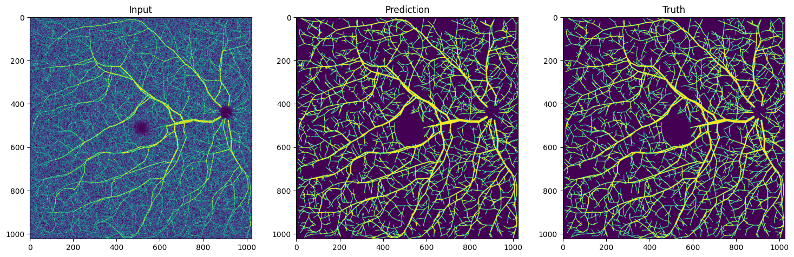

# OCTA-seg
This repository uses [Monai](https://monai.io/) to implement a [nnU-net](https://www.nature.com/articles/s41592-020-01008-z) that is trained to segment vessels in (synthetic) 2D OCTA-images

